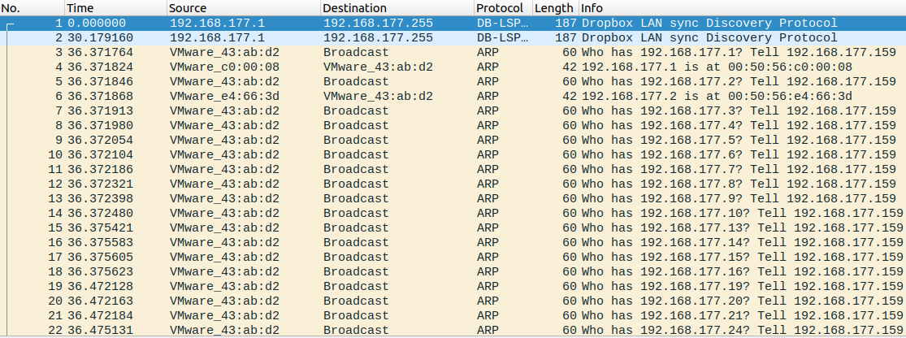
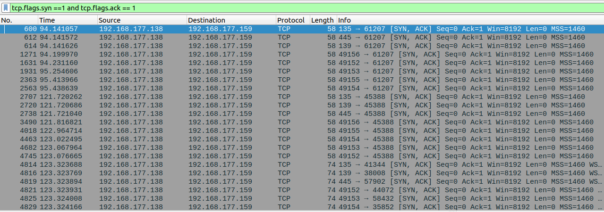
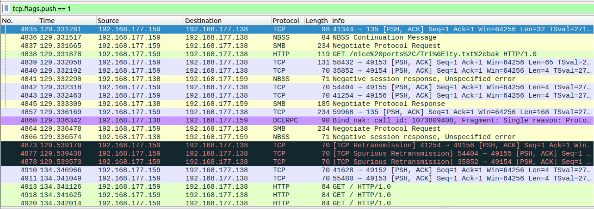
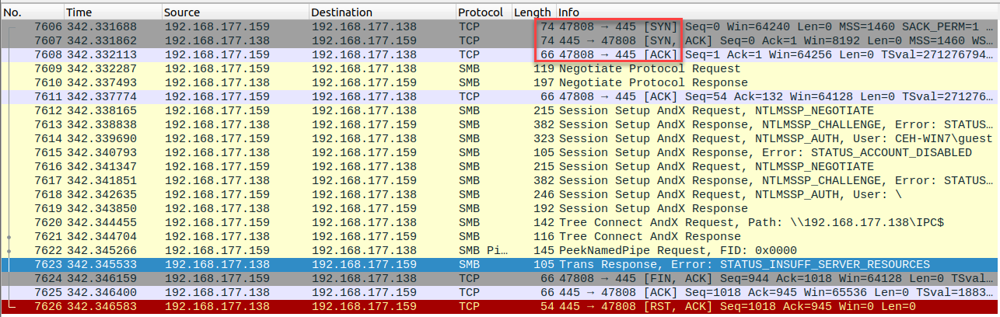
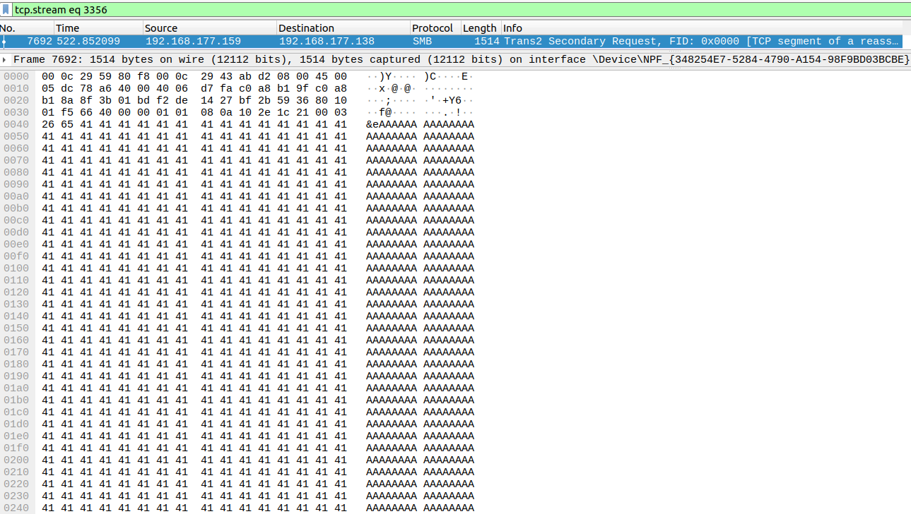
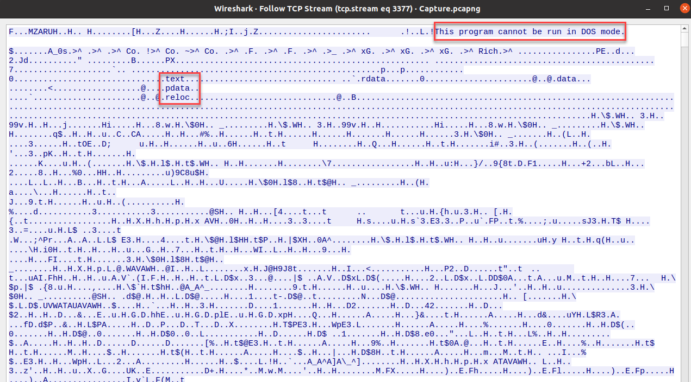

# Incident Triage
# Lab Description: In this challenge, you will review a capture file sent to you by a Level One Security Operations Center (SOC) Analyst
In this lab you will perform the role of a Level Two Security Operations Center (SOC) Analyst, and your task in this lab is to investigate, analyze and determine if the network traffic forwarded to you for review from the Level One analyst should be escalated and assigned to the Computer Security Incident Response team for triage collection and incident response procedures.

A bit of background, the scenario here is that of an adversary that has been identified through threat intelligence and has targeted your organization. You are a SOC Level Two Analyst for Globomantics. The group that has targeted your organization is the infamous Dark Kitten group that represents a potential Advanced Persistent Threat (APT), but this has not been validated, and part of your experience here will be to explore the methods that have been deployed and determine is this actually a sophisticated attack from a high-level threat or not.

In this lab, you will use the Wireshark tool and analyze the static file, this is in line with the current scenario of being the Level Two analyst, the “live” and real time capture would have been done and should have been observed by the Level One analyst. Let’s get started with Intrusion Analysis and Incident Response! One caveat before we get started, the reality is you never know if you are right or wrong, we have to use the skills we have and experience to the best of our ability, sometimes it works and sometimes it does not. Again, as Level Two we will just escalate and let the CSIRT assigned take it to the point of litigation or not.

We need an Ubuntu machine to run our Wireshark tool, we can then run our script. In the example here we are using Ubuntu 20.04, but most versions of Ubuntu should support Wireshark.

1.	Before we actually open the file, we want to explain the concepts that a Level Two analyst should have an understanding of. The main thing for an analyst is to understand the mindset of an attacker. When an attacker or a group of attackers targets an organization. The first thing that they do is plan. We define an abstract methodology as the following steps:
   
    a.	Planning

    b.	Non-Intrusive Target Search

    c.	Intrusive Target Search

    d.	Remote Target Assessment

    e.	Local Target Assessment

    f.	Data Analysis

    g.	Report

4.	For our lab here we will focus on the Intrusive Target Search, this is where the majority of the attack will be concentrated. Within this step we have our scanning methodology and we further define this as follows:
   
    a.	Live Systems

        i.	There has to be a target to attack

    b.	Open ports

        i.	There has to be doors open on the target

    c.	Services

        i.	What is behind those open doors

    d.	Enumeration

        i.	Are there any shares, users and what is the OS

    e.	Identify Vulnerabilities

        i.	We have to find a weakness as an attacker, and as a defender we have to track our weaknesses

    f.	Exploitation

        i.	Leverage the weakness to gain access. 
5. It is important to understand while all systems and networks will have vulnerabilities, not all will be exploitable
6.	Now that we have the background of the attacker mindset and methods. We can turn our attention to that of the analyst.
7.	In our scenario here, Level One has provided a network capture file of what they expect is an intrusion into the Golobomantics organization.
8.	We have a methodology that we can use that reverses the steps of the scanning methodology from the perspective at the packet level.
9.	This methodology is as follows:

    a.	Suspicious

        i.	Does anything look suspicious

    b.	Open ports

        i.	There has to be an open port and an attack surface to attack

    c.	Data

        i.	Just detecting an open port does an attacker no good, they need to extract and exfiltrate, impossible to do without data

    d.	Streams

        i.	In TCP traffic we have streams of communication, and if this is not encrypted then we can determine what has taken place. We also have these in UDP, but they are         handled a little differently, and not part of what we are doing here

    e.	Signs of compromise

        i.	Once we have data and we have streams, the next step is to see if we can determine the signs of compromise
10.	Now that we have the background, let us look at the capture file from the Level One analyst and provide our methodology to it for our analysis.
11.	Now let's open up Wireshark itself by going to the left side of the Desktop and selecting the **Applications** Button.

12.	In the Search bar enter **Wireshark**.
13. Once the program opens, click on **File | Open** and navigate to the **Downloads** folder and open the **Capture.pcapng** file that is located there.
14. As soon as the file opens it should JUMP out at you that something is not right! If it does not, do not worry you will learn as you enhance your skills.
15. What we are referring to here is the first series of packets that have been captured.

    
15. Look at all of these ARP packets! In case you didn’t know, this is the Address Resolution Protocol, and it takes the IP address and maps if to the Media Access Control or MAC address! The thing that is important here is the fact that the data is delivered to this physical address! We now have another problem! The protocol is a Local Area Network (LAN) protocol, and as such this means the intruder is in our network! Not only that, they are performing the first step of our scanning methodology and they are looking for live systems! If we had these messages in ICMP then we would feel a little better since that would mean the attacker is still external to us, but this is the worst case for our analysis because it is LOCAL and on our network!
16. Now, look how these packets are sequentially walking up an IP address! Again, a dead giveaway that we have reconnaissance taking place. Do you remember the next step? Open ports!
17. We will leverage the power of Wireshark to extract the open ports. In the filter window of Wireshark enter the following:
a.	**tcp.flags.syn == 1 and tcp.flags.ack == 1**

18.	The important thing to realize is by doing this we know immediately what the attacker saw! Which in this case is only a few ports open. This has reduced our capture file from 8370 to 121! That is more than 98%! Now, the process would be to create a host list and identify what machines have these ports open. In fact, you might be surprised to learn that if we were on offense and doing penetration testing it is the same process! We as an attacker need the open ports, just as the defender does! The next step? Data!
19.	We can reference the data by looking at the flags of the Transmission Control Protocol (TCP). The flag that is responsible for Data is the PUSH flag. We can extract this by entering the following filter:
a.	**tcp.flags.push == 1**

20. Now these data packets represent the communication streams, and even if the data is encrypted we can still discover artifacts that can help us classify the attack
21.	The process is to right-click each packet and then select **Follow TCP Stream** and look for the signs of compromise and analyze what exactly took place in the communication sequence
22.	The first stream we want to look at can be entered into the filter window to save time. Etner the following into the filter window: **tcp.stream eq 3353.**

  
23. In the red box you can see that the TCP 3 way handshake is to the port 445. Once this completes then data will flow and it does. Located at packet number 7623 you can see the Error message from the connection query.

  

24. So, if you do some research you will discover that this response is very important to the attacker! This tells them that this machine is not patched and is vulnerable to the Microsoft Bulletin **MS17-010** which more commonly is known as the vulnerability that is exploited by the **“Wanna Cry”** ransomware. 
25.	Since the attacker has discovered this, the task of you, the Level Two is to see did it lead to a compromise! We know the vulnerability was discovered by the attacker, but immediately after we see them tear down the connect with the **RST/ACK** flag in packet number **7626**, so in this stream example the attacker has just checked, so now we need to continue analysis to see if they moved beyond the check and leveraged to gain access.
26.	If we enter **tcp.stream eq 3356** in the filter window, we can see some interesting packets.

  
  
27. What in the world is this? We have the character A, so is this normal? Does it look normal? Hopefully, you are saying NO! This is not normal, and it is not, so if you are GOOD JOB! If not, it is okay because it comes with experience and what is it? A classic method of buffer overflow! Where the attacker is trying to leverage the MS17-010 weakness that was identified! So, what now? We have to see was it successful or not! How do we do this? Stick with us, and continue your analysis, look at more streams!
28.	We now enter the following into the filter window **tcp.stream eq 3377.**

    
29.	As we say this is proof and the Level Two can confirm and escalate to the CSIRT. This is an executable file that has been passed via network traffic and is indicated by the first red box which is what is referred to as the program stub then the actual section headers identified in the next box! We have a compromised machine, and the attacker is using encryption, so we will not be able to read what is taking place, but as the Level Two, our job is done. We need to escalate and pass it on. One thing to note here is that part of the report by the Level Two would be that this is the default and well known port of Metasploit the exploit framework and as a result of this, the group is not considered sophisticated and part of an APT!
30.	Now, what do we do?
31.	This will be dependent on policy, but in most cases we would isolate the compromised machines and see if there are any more machines to look at, but for our purposes here we have accomplished what we wanted to do! Congratulations! You have identified a compromised machine, and in fact two machines in this case since the attacker is inside there has to be a machine that let them in. Again, if possible, these machines should be removed from the network so the investigation can continue and once all of the evidence has been gathered. The machines need to be rebuilt and brought back onto the network. Great work!
 	
